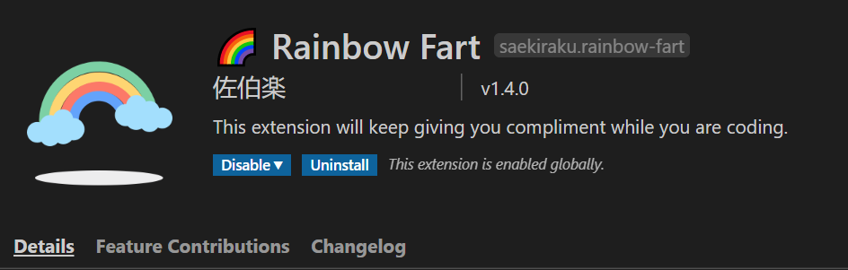
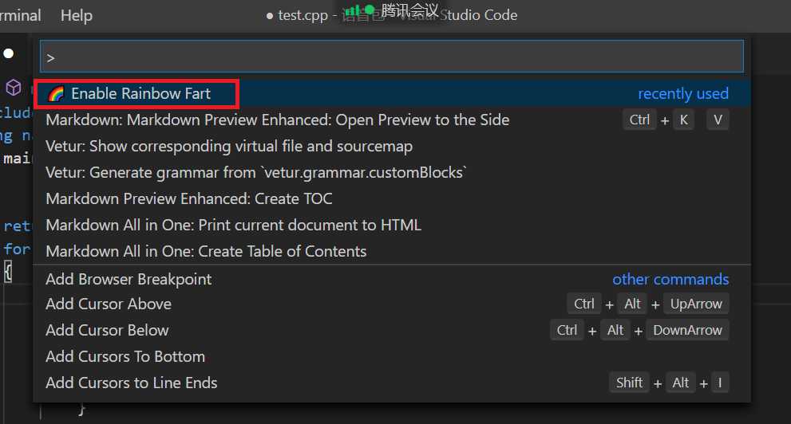
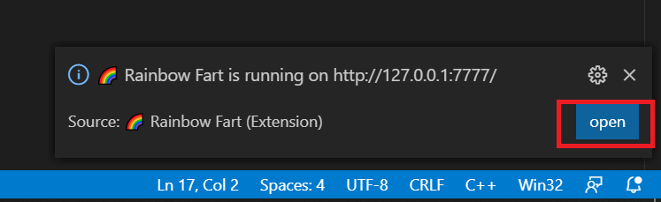
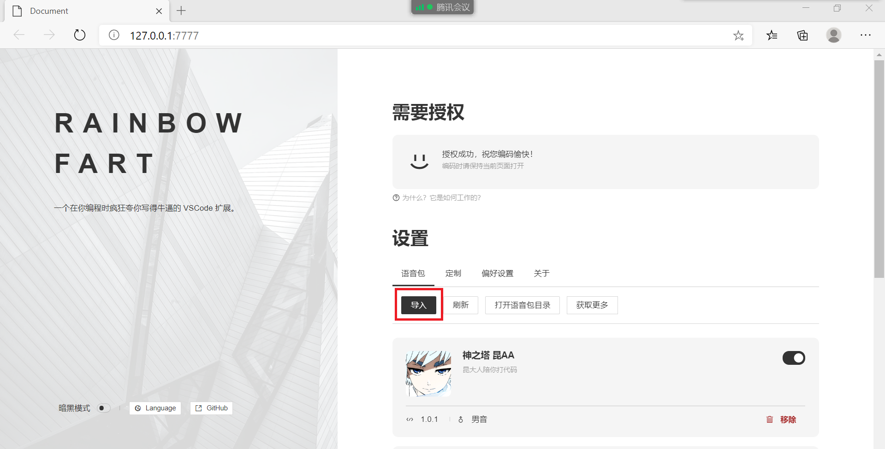
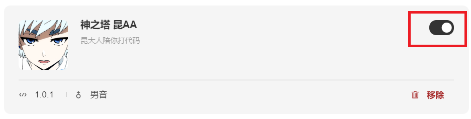
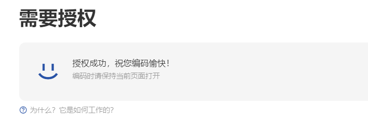

# kun-AA-rainbow-fart
## 01 下载语音包

程序媛福利！彩虹屁语音怎么少的了我们AA呢？（不用vscode的姐妹也可以直接听着玩）

[release](https://github.com/WOC-BUG/kun-AA-rainbow-fart/releases/tag/v1.0)

## 02 一些说明

* 官方仓库指路：[vscode-rainbow-fart](https://github.com/SaekiRaku/vscode-rainbow-fart)
* 暂无深夜版本
* 适用于C和C++的一些基础用语
* 共95条语音，关键词触发会有重复语音
* 关键词和语音并无太大关联（硬凑也得听到AA讲话！）
* [关键词和语音对应说明](./kun-AA/AA语录.md)

## 03 使用方法

1. 打开vscode下载官方插件：``Rainbow Fart``

2. 使用``Ctrl + Shift + P``（Mac系统是 ``Command + Shift + P``）调起``Command Panel``，并选中``Enable Rainbow Fart``

3. 在右下角弹出的窗口中选择``open``

4. 在打开的页面中选择导入刚刚下载的``zip``压缩包（无需解压）

5. 启用语音包

6. 最后点击上方授权，有钢琴声就表示授权成功

---

开启和AA的登塔之旅吧~